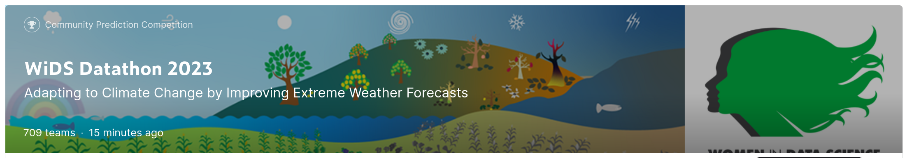

<h4>
:sunglasses:[ WiDS-Datathon-2023] Adapting to Climate Change by Improving Extreme Weather Forecasts:
</h4>

In this competition, our aim is to train a machine learning model to predict the arithmetic mean of the maximum and minimum temperature over the next 14 days, for each location and start date. 
 

#### Methods :point_down:
The implemented solution can be summarized in the following core steps:
* Pre-processing
* CatBoostRegressor
* KFold as a bagging approach
* BayesSearchCV
* Ensemble learning using StackingRegressor
